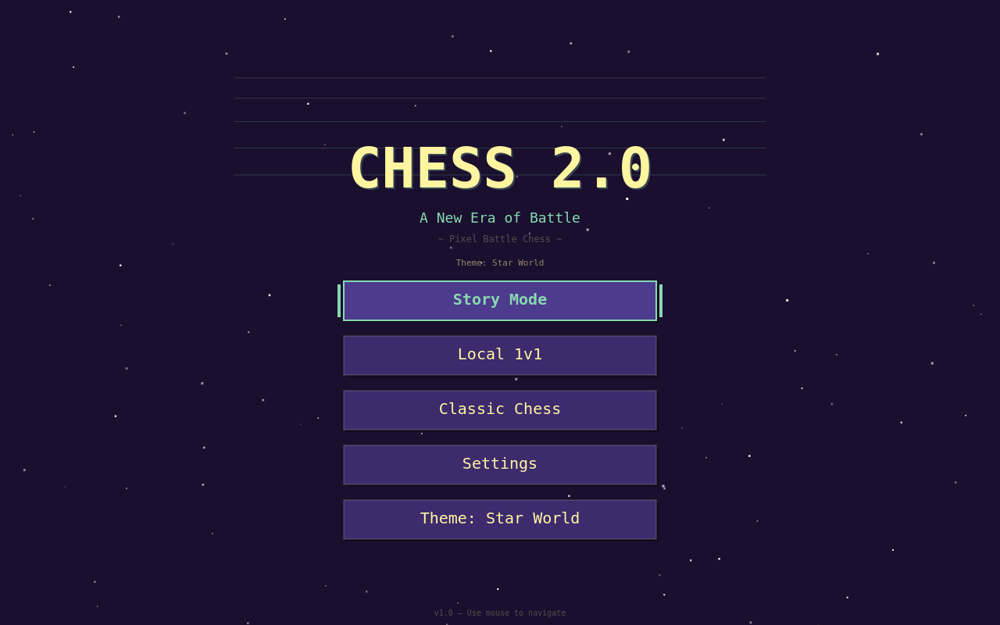
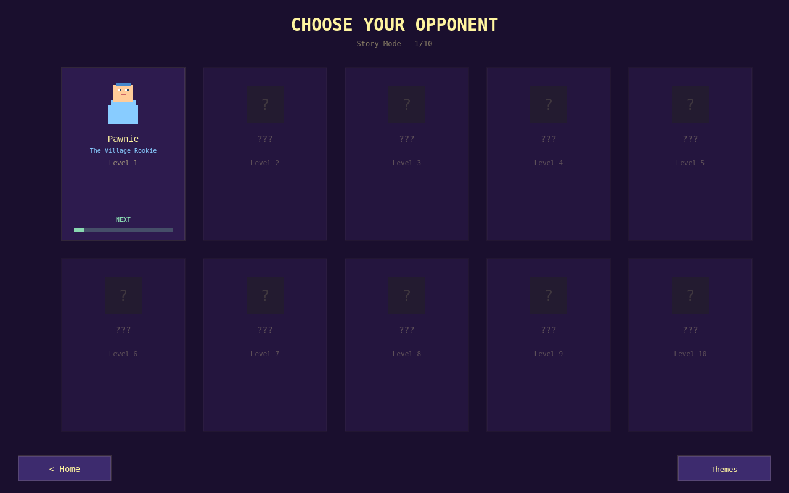
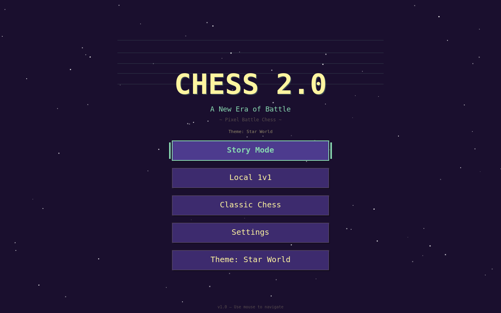
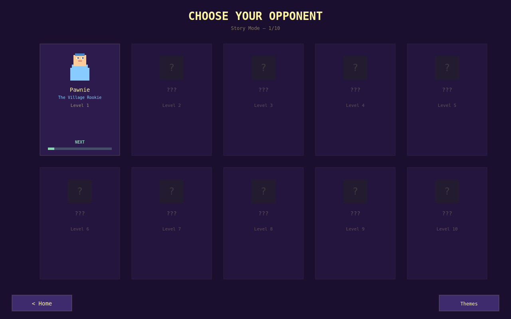
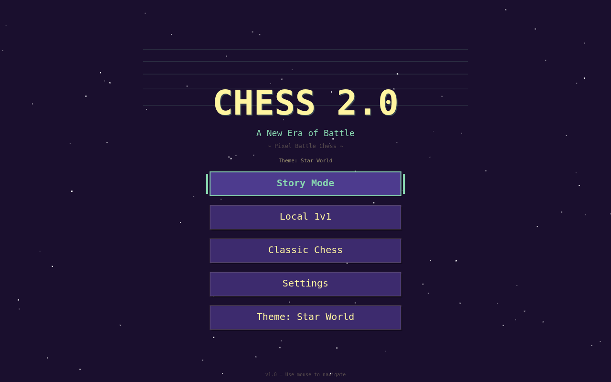

# Chess 2.0 - A Pixel Chess Adventure

A fully-featured pixel-art chess game built with Electron and vanilla JavaScript. Play classic chess, challenge unique characters in Story Mode, or battle a friend in local 1v1. Featuring dynamic themes, character dialogue, capture minigames, and a custom chess engine with AI opponents.

---

## Screenshots

| Home Screen | Mode Select | Game Screen |
|:---:|:---:|:---:|
|  |  |  |

| Character Select | Theme Select | Pause Menu |
|:---:|:---:|:---:|
|  |  |  |

---

## Features

| Feature | Description |
|---------|-------------|
| **Story Mode** | Battle 5 unique characters with personality-driven dialogue and escalating difficulty |
| **Local 1v1** | Two players on the same machine with full chess rules |
| **Classic Chess** | Play against the built-in AI engine with adjustable depth |
| **Dynamic Themes** | 3 fully-themed visual styles (Space, Medieval, Ocean) with unique color palettes |
| **Character System** | Each opponent has unique dialogue, colors, and AI personality |
| **Capture Minigames** | 13 skill-based minigames trigger on piece captures for bonus rewards |
| **Particle Effects** | Animated stars, explosions, and visual feedback |
| **Save System** | Persistent settings, unlocked themes, and progress tracking |
| **Custom Engine** | Full legal move generation, check/checkmate detection, and AI search with alpha-beta pruning |

---

## Game Modes

### Story Mode
Face off against 5 themed opponents in order of difficulty:

| Level | Character | Title | Personality |
|:-----:|:----------|:------|:------------|
| 1 | Pawnie | The Village Rookie | Nervous |
| 2 | Bish-Bosh | The Diagonal Dreamer | Enthusiastic |
| 3 | Rook-E | The Iron Tower | Stoic |
| 4 | KnightShade | The Shadow Lancer | Mysterious |
| 5 | Queenie | The Royal Tyrant | Arrogant |

Each character greets you before battle and reacts to victory or defeat.

### Local 1v1
Two players take turns on the same keyboard. Standard chess rules apply.

### Classic Chess
Play against the AI with full control over search depth and difficulty. The AI uses alpha-beta pruning with piece-square tables and material evaluation.

---

## Themes

Switch between visual themes that change the entire board, pieces, UI, and background:

| Theme | Name | Description |
|:-----:|:-----|:------------|
| `space` | Star World | Rainbow road in the cosmos |
| `medieval` | Castle World | Brick blocks and flags |
| `ocean` | Water World | Bubbles and coral pipes |

Themes affect: board colors, piece colors, highlights, backgrounds, buttons, panels, text, and particle effects.

---

## Capture Minigames

When a piece is captured, a skill minigame may trigger (30% chance, toggleable in Settings). Win the minigame for bonus rewards:

| Minigame | Skill Tested |
|----------|-------------|
| Quick Click | Speed clicking |
| Memory Match | Pattern memory |
| Timing Strike | Precise timing |
| Pattern Press | Sequence input |
| Reaction Test | Reflexes |
| Undertale Dodge | Bullet dodging |
| Power Meter | Charge control |
| Bar Balance | Balance keeping |
| Target Practice | Aiming |
| Dodge Falling | Avoidance |
| Rhythm Tap | Rhythm timing |
| Number Guess | Logic deduction |
| Coin Flip | Chance |

Difficulty scales based on the value of the captured piece.

---

## Controls

| Key | Action |
|:---:|:-------|
| `Arrow Keys` / `WASD` | Navigate menus, move cursor on board |
| `Enter` / `Space` | Select / Confirm |
| `Escape` | Back / Pause |
| `F` | Flip board (in-game) |
| `H` | Toggle move hints (in-game) |
| `P` | Toggle particles (in-game) |

---

## Tech Stack

| Technology | Purpose |
|:-----------|:--------|
| **Electron** | Desktop application wrapper |
| **HTML5 Canvas** | 2D rendering engine |
| **Vanilla JavaScript** | Game logic (no frameworks) |
| **Node.js** | Runtime & package management |

---

## Architecture

The codebase is organized into modular components:

```
src/
  audio/          # Sound and music management
  characters/     # Character definitions and manager
  engine/         # Chess engine (board, moves, rules, AI)
  input/          # Keyboard input and keybindings
  minigames/      # 13 skill-based minigames
  rendering/      # Canvas rendering (board, pieces, particles, textures)
  screens/        # UI screens (home, game, menus, settings)
  state/          # Global state store (settings, progress)
  themes/         # Theme definitions and manager
  index.html      # Entry point, loads all modules
  main.js         # Game loop and screen router
```

---

## Installation

### Prerequisites
- [Node.js](https://nodejs.org/) v20+
- npm (comes with Node.js)

### Clone & Run

```bash
# Clone the repository
git clone https://github.com/iGLORM/chess.git
cd chess

# Install dependencies
npm install

# Start the game
npm start
# or
npx electron .
```

### Linux Desktop Entry (Optional)

A launcher script is included:

```bash
# Make executable
chmod +x launch.sh

# Run
./launch.sh
```

---

## Assets

Textures and sprites are procedurally generated at runtime using the `SpriteGen` and `TextureManager` modules. No external image assets are required for the core game.

The `assets/textures/` folder contains a README for adding custom texture packs.

---

## Development

### Project Structure

| File | Purpose |
|:-----|:--------|
| `main.js` | Electron main process |
| `preload.js` | Secure preload script |
| `src/main.js` | Game bootstrap and loop |
| `src/index.html` | Module loader |
| `package.json` | Dependencies & scripts |

### Scripts

```bash
npm start       # Launch the game
npm test        # (No tests configured yet)
```

---

## Roadmap

- [ ] Online multiplayer
- [ ] More themes (Forest, Lava, Ice)
- [ ] Additional characters with unique AI strategies
- [ ] Sound effects and music
- [ ] Game replay / PGN export
- [ ] Mobile / touch support
- [ ] Elo rating system

---

## License

This project is open source. See [LICENSE](LICENSE) for details.

---

## Acknowledgments

- Pixel art aesthetic inspired by retro arcade games
- Chess piece values and evaluation based on standard engine principles
- Built with love for the game of chess
