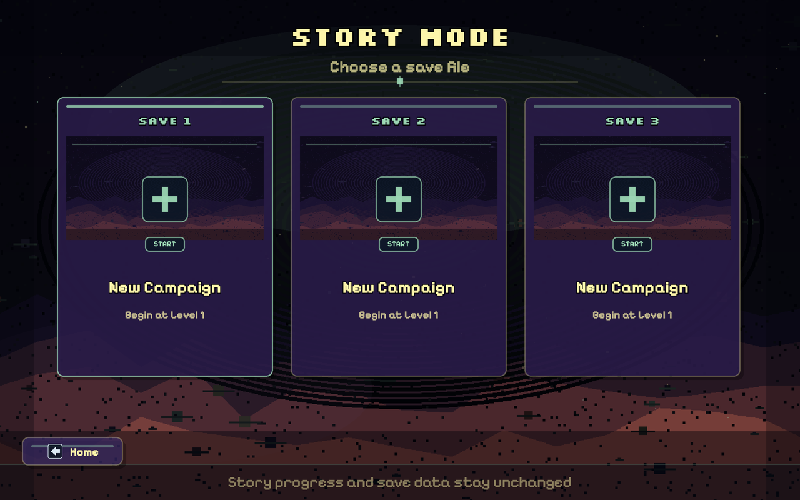
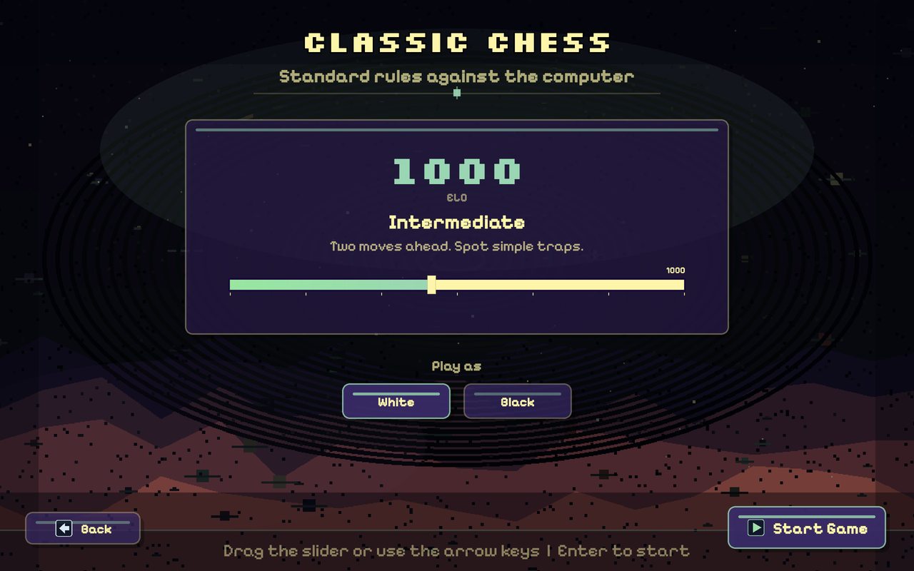
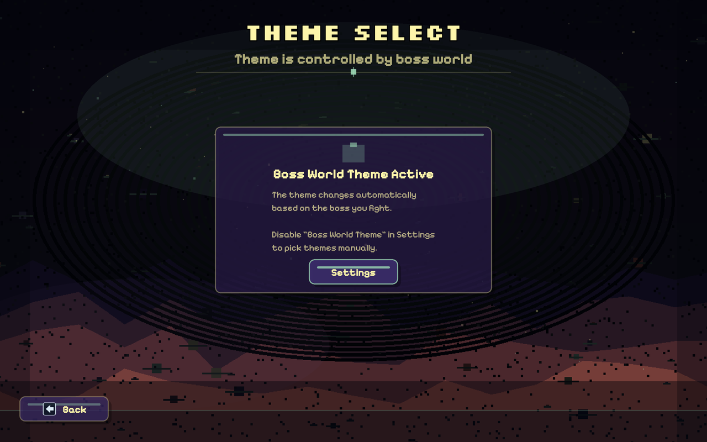

<p align="center">
  
</p>

<p align="center">
  <strong>A fully-featured pixel-art chess game built with Electron and vanilla JavaScript.</strong><br/>
  <strong>Play on desktop or mobile via <a href="https://t.me/iglorm_chess_bot?startapp=play">Telegram Mini App</a></strong>
</p>

<p align="center">
  
  
  
  
  
  
  
  <br/>
  
  
  
  
</p>

<p align="center">
  Chess with a twist: when a piece is about to be captured, its owner can fight back in a quick mini-game.<br/>
  Challenge ten characters in Story Mode, play the computer, solve puzzles, or battle a friend on the same screen.
</p>

---

## Screenshots

<p align="center">

| Home Screen | Settings | Character Select |
|:---:|:---:|:---:|
|  |  |  |

| Bot Select | Custom Game | How to Play |
|:---:|:---:|:---:|
|  |  |  |

| Stats | Game Screen | Theme Select |
|:---:|:---:|:---:|
|  |  |  |

</p>

---

## The Chess 2.0 Rule

Everything is normal chess, with one twist:

- When one of your pieces is about to be captured, you can spend a **Defense** to play a quick skill mini-game.
- **Win** it and the capture is cancelled: the attacking piece stays where it was and your opponent loses their turn.
- **Lose** it and the capture goes through.
- Each side starts with **2 Defenses** and earns **1 more for every 2 captures**.
- A capture that gets a king **out of check** can't be blocked (otherwise a king could be left in check and captured).

The rule is on in Story Mode and Local 1v1, off in Classic Chess, and your choice in Custom Game.

---

## Features

| Feature | Description |
|:--------|:------------|
| **Story Mode** | Beat 10 characters in order, each with their own personality and dialogue, across 5 difficulty tiers and 3 save slots |
| **Local 1v1** | Two players on the same screen, Chess 2.0 rules on |
| **Classic Chess** | Standard chess against the computer, 200-2000 Elo, play as White or Black |
| **Custom Game** | Pick the bot strength, your side, whether Defenses are on, and which mini-games can appear |
| **Training** | 30 puzzles with stars, hints and a coach, plus a board editor |
| **15 Capture Mini-Games** | Skill games that decide contested captures; practise any of them from Settings |
| **Undo, flip, review** | Take back moves, flip the board, and step through the game's history |
| **Resume** | An unfinished game is saved after every move and can be resumed from the home screen |
| **Themes** | 11 visual themes that change the board, pieces, background and particles |
| **Works offline** | All libraries, fonts and the Stockfish engine are bundled; every bot runs on your computer, no internet needed |
| **Desktop, web & phone** | Electron app for Windows/macOS/Linux, and the same code runs in a browser and as a [Telegram Mini App](https://t.me/iglorm_chess_bot?startapp=play) with a portrait layout |

---

## Game Modes

### Story Mode

Face ten opponents in order. Pick a difficulty tier when starting a save; each win unlocks the next character.

| Level | Character | Title |
|:-----:|:----------|:------|
| 1 | Pawnie | The Village Rookie |
| 2 | Bish-Bosh | The Diagonal Dreamer |
| 3 | Rook-E | The Iron Tower |
| 4 | KnightShade | The Shadow Lancer |
| 5 | Queenie | The Royal Tyrant |
| 6 | CastlE | The Unbreakable Fortress |
| 7 | EndGamer | The Patient Scholar |
| 8 | ForkMaster | The Tactician |
| 9 | Checkmate | The Executioner |
| 10 | Grandmaster X | The Absolute |

### Local 1v1

Two players take turns on the same screen with Chess 2.0 rules. Player names can be set in Settings.

### Classic Chess

Standard chess against the computer. Choose a strength from 200 to 2000 Elo and play as White or Black.

---

## Themes

Switch between visual themes that change the entire board, pieces, UI, and background:

| Theme | Name | Description |
|:-----:|:-----|:------------|
| `space` | Cosmic Abyss | Twinkling stars, shooting stars, nebula glows |
| `medieval` | King's Fortress | Floating embers, torch glow pulses |
| `ocean` | Deep Blue | Rising bubbles, underwater light rays |
| `japanese` | Cherry Blossom | Falling cherry blossoms with rotation |
| `crystal` | Crystal Cavern | Sparkling crystal flashes |
| `cyberpunk` | Neon Grid | Data streaks, digital rain |
| `egypt` | Desert Sun | Drifting sand, heat shimmer |
| `steampunk` | Brass Works | Rising steam wisps, rotating gears |
| `prehistoric` | Lost World | Floating spores, mist banks |
| `artdeco` | Golden Age | Geometric gold shapes |
| `wildwest` | Dusty Trail | Blowing dust particles |

Each theme has a matching title logo variant (original, magma, or ice). Themes affect board, pieces, UI, backgrounds, particles, and buttons. There are 11 themes plus a custom colour theme.

---

## Capture Mini-Games

Quick Click, Memory Match, Timing Strike, Pattern Press, Reaction Test, Soul Dodge, Power Meter, Target Practice,
Dodge Falling, Rhythm Tap, Number Guess, Coin Flip, Bar Balance, Shield Block and Whack-a-Mole.

One is picked at random for each contested capture. Difficulty scales with the value of the threatened piece,
and when the computer defends, it plays the mini-game at a skill matching its strength.

---

## Controls

| Input | Action |
|:-----:|:-------|
| Click / tap | Select a piece, then a highlighted square |
| `U` or `Cmd/Ctrl+Z` | Undo your last move (against the computer, also undoes its reply) |
| `F` | Flip the board |
| `←` / `→` | Step back / forward through the game |
| `Esc` | Pause menu (resign, settings, quit) / back in menus |
| `Enter` | Confirm in menus |
| `F11` | Toggle fullscreen (desktop) |

The **UNDO**, **FLIP**, **<**, **>** and **LIVE** buttons under the board do the same things.

---

## Getting Started

### Download & Play (No Setup Required)

Pre-built binaries are published on the [Releases](https://github.com/iGLORM/CHESS2.0/releases) page when available:

| Platform | Download | Notes |
|:---------|:---------|:------|
| **Windows** | `Chess-2.0-win-portable.zip` | Extract and run `Chess 2.0.exe` |
| **macOS** | `Chess-2.0.dmg` | Open the DMG and drag to Applications |
| **Linux** | `Chess-2.0.AppImage` | `chmod +x` and run |

### Build from Source

#### Prerequisites

- [Node.js](https://nodejs.org/) v20+

#### Run

```bash
git clone https://github.com/iGLORM/CHESS2.0.git
cd CHESS2.0
npm install
npm start
```

If `npm start` says Electron failed to install, run `node node_modules/electron/install.js` once.

To play in a browser instead, serve the repository root with any static web server
(for example `python3 -m http.server`) and open `http://localhost:8000/src/index.html`.

#### Test

```bash
npm test
```

Runs the chess-engine and Chess 2.0 rule tests (move generation, check, en passant, notation, capture defense).

#### Build Distributable

```bash
npm run build:win     # Windows installer + portable exe
npm run build:mac     # macOS DMG
npm run build:linux   # Linux AppImage + deb
```

Built files are written to `dist/`.

For Steam, `npm run build:steam:win` / `build:steam:mac` / `build:steam:linux` produce the unpacked
app folders to upload. See [STEAM_RELEASE.md](STEAM_RELEASE.md) for the full release checklist.

### Platform Launchers

| Platform | Launcher | Usage |
|:---------|:---------|:------|
| **Windows** | `launch.bat` | Double-click or run from cmd |
| **Linux / macOS** | `launch.sh` | `chmod +x launch.sh && ./launch.sh` |

---

## Architecture

```
src/
  audio/          Sound and music management (Web Audio API)
  characters/     Character definitions and manager
  engine/         Chess engine (board, moves, rules, Chess 2.0 capture rules, notation, AI)
    ai/           Alpha-beta search, evaluation, difficulty controller
  input/          Keyboard input and keybindings
  layout/         Orientation detection and responsive layout (portrait/landscape)
  minigames/      15 skill-based capture mini-games
  pixi/           PixiJS v8 renderers (board, pieces, backgrounds, UI components)
  rendering/      Canvas 2D rendering (board, pieces, particles, UIHelpers, TextFit)
  screens/        UI screens (home, game, menus, settings)
  state/          Global reactive state store
  telegram/       Telegram Mini App compatibility layer
  themes/         Theme definitions and manager
  vendor/         Bundled PixiJS, GSAP, fonts and pretext (no CDN needed)
  main.js         Game loop and screen router
  index.html      Entry point
tests/            Node tests for the engine and rules (npm test)
```

| File | Purpose |
|:-----|:--------|
| `main.js` | Electron main process |
| `preload.js` | Secure preload script (context isolation) |
| `src/main.js` | Game bootstrap, loop, and screen routing |
| `src/index.html` | Module loader |

Textures and sprites are procedurally generated at runtime using the `SpriteGen` and `TextureManager` modules. The `assets/textures/` folder supports custom texture packs.

---

## Roadmap

- [x] Mobile / touch support (Telegram Mini App with portrait mode)
- [x] Undo, board flip and resuming unfinished games
- [ ] Online multiplayer
- [ ] Game replay / PGN export
- [ ] Elo rating system

---

## License

No license file has been added yet. The bundled fonts (Pixelify Sans, Silkscreen) are under the SIL Open Font
License 1.1; PixiJS is MIT; GSAP is under its own standard license.

---

## Acknowledgments

- Pixel art aesthetic inspired by retro arcade games
- Chess piece values and evaluation based on standard engine principles
- Built with love for the game of chess
