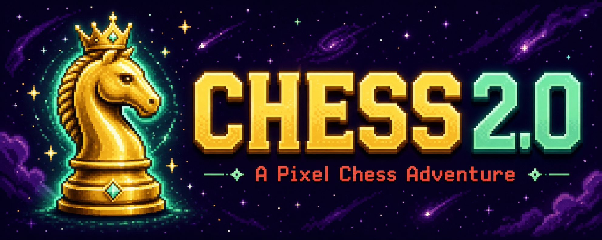
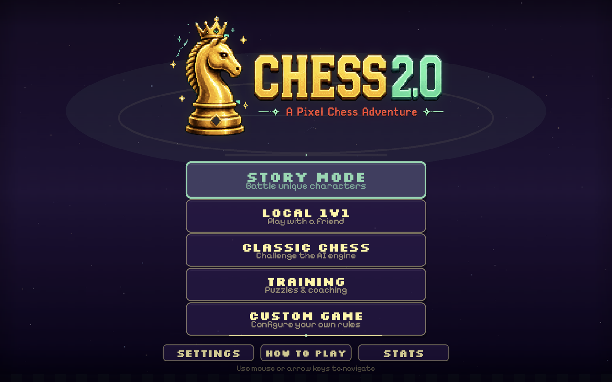
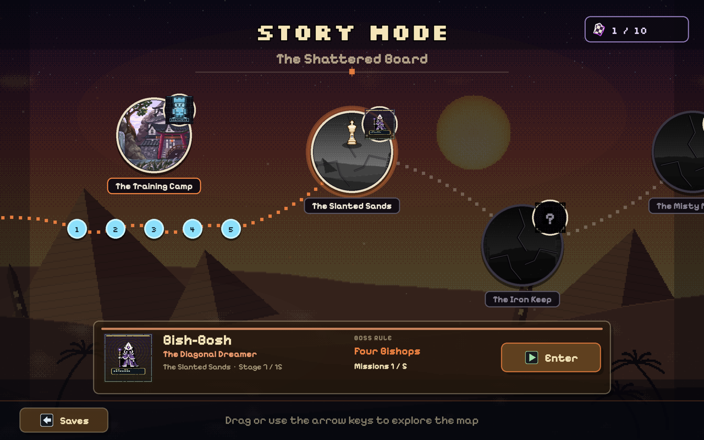
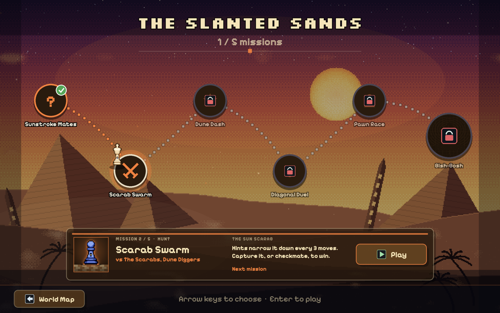
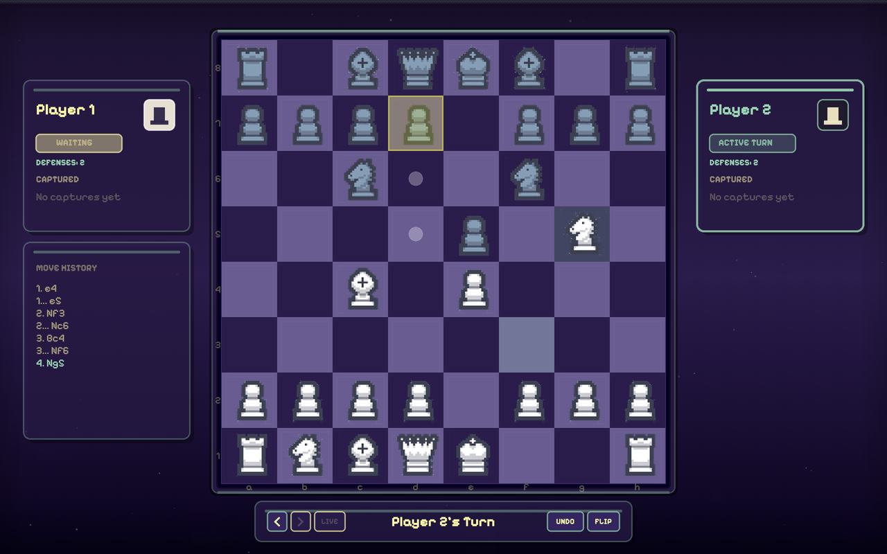
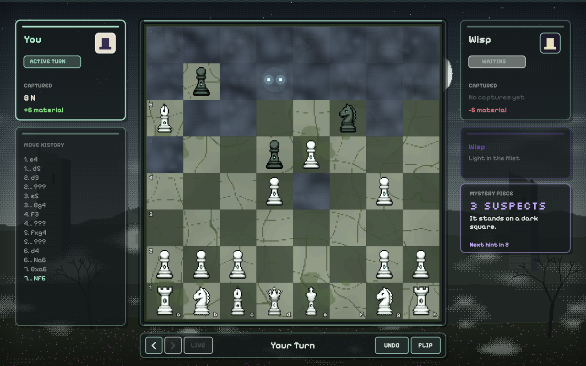
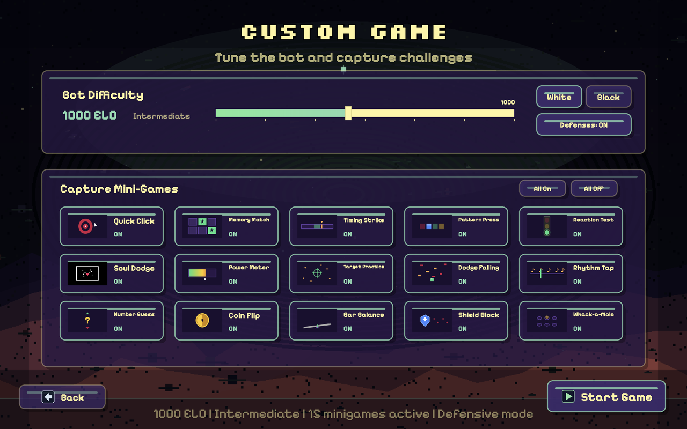
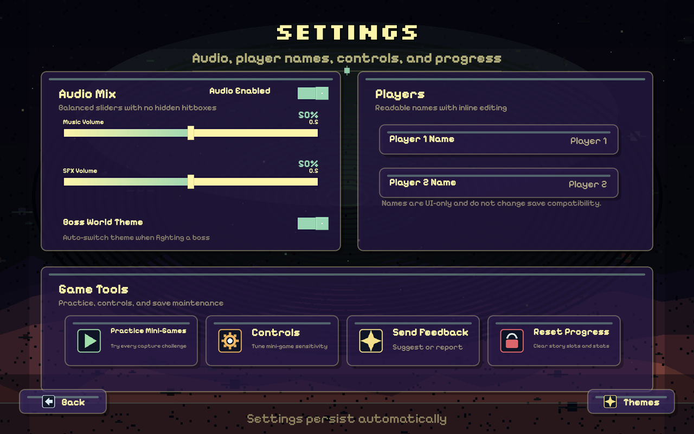
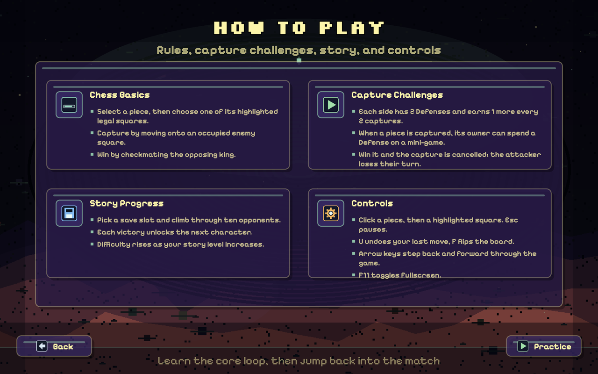
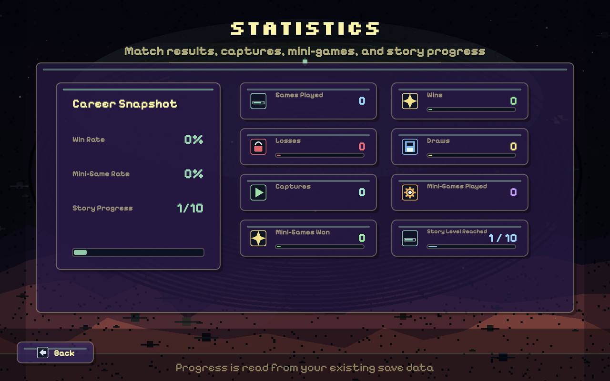

<p align="center">
  
</p>

<p align="center">
  <strong>A fully-featured pixel-art chess game built with Electron and vanilla JavaScript.</strong><br/>
  <strong>Play on desktop, or in your browser at <a href="https://game.altobolt.com">game.altobolt.com</a></strong>
</p>

<p align="center">
  
  
  
  
  
  
  
  <br/>
  
  
  
</p>

<p align="center">
  Chess with a twist: when a piece is about to be captured, its owner can fight back in a quick mini-game.<br/>
  Cross eleven shattered worlds in Story Mode, play the computer, solve puzzles, or battle a friend on the same screen.
</p>

---

## Screenshots

<p align="center">

| Home Screen | World Map | World Missions |
|:---:|:---:|:---:|
|  |  |  |

| Story Fight | Mystery Piece in the Fog | Custom Game |
|:---:|:---:|:---:|
|  |  |  |

| Settings | How to Play | Stats |
|:---:|:---:|:---:|
|  |  |  |

</p>

---

## The Chess 2.0 Rule

Everything is normal chess, with one twist: **captures can be challenged with a quick 3D arcade mini-game.** Each mini-game takes on the colours of the world you are in.

- **Local 1v1 (Defenses):** when one of your pieces is about to be captured, you can spend a
  **Defense** to play a mini-game. Win it and the capture is cancelled and your opponent loses their turn.
  Each side starts with **2 Defenses** and earns **1 more for every 2 captures**.
- **Story Mode and Custom Game (Challenges):** any capture may start a challenge (about 1 in 3, and some bosses change the odds).
  The **attacker** plays it: win and the capture goes through, lose and it is cancelled and that square locks.
- A capture that gets a king **out of check** can never be blocked.

Classic Chess is plain chess with no mini-games.

---

## Features

| Feature | Description |
|:--------|:------------|
| **Story Mode** | "The Shattered Board": 15 stages across 11 worlds, a world map, cutscenes, 63 missions and 9 guardians who each bend the rules |
| **Local 1v1** | Two players on the same screen, with Defenses |
| **Classic Chess** | Standard chess against the computer: 13 strengths (about 250 to 3000 Elo), as White, Black or a random side |
| **Custom Game** | The same bot strengths and side choice, with capture challenges from the mini-games you pick |
| **Training** | 30 Stockfish-checked puzzles with stars, hints and a coach, mini-game practice, and a board editor whose positions you play out against the coach |
| **18 3D Mini-Games** | Retro-styled Three.js arcade games that decide contested captures; practise any of them from Training |
| **Stockfish AI** | Every bot is the bundled Stockfish 18, from human-like beginner mistakes up to full strength |
| **Undo, flip, review** | Take back moves, flip the board, and step through the game's history |
| **Resume** | An unfinished game is saved after every move and can be resumed from the home screen |
| **World themes** | The Chess 2.0 theme (the Great Board at dusk, the one you start with), 11 painted world themes (board, piece set, animated background and song) and the Great Board reward theme, plus a custom colour theme; every background is a living pixel scene drawn in code |
| **Synthesised music** | Every theme has its own song, generated live with Web Audio, with a tense version during check |
| **Graphics settings** | Display mode, resolution, frame limit, brightness and an FPS counter, plus Low to Ultra quality presets (background motion, particles, 3D mini-game sharpness and shadows), retro filter and screen shake |
| **Credits roll** | Full scrolling credits with the cast of the story, like the end of a big game |
| **Works offline** | All libraries, fonts and the engine are bundled; no internet needed |
| **Desktop, web & phone** | Electron app for Windows/macOS/Linux, and the same code runs in a browser, with a portrait layout on phones |

---

## Story Mode: The Shattered Board

For an age the world has been splitting apart, crack by crack. Then you fall from the sky into Pawn Hollow,
with no memory and a glowing shard of the Great Board in your hand, and the splitting stops. The board broke into
four pieces: yours, and three held by the EndGamer, Checkmate and Grandmaster X. The other guardians each hand over
a keepsake when you beat them (a tilted compass, the Iron Key, the Mist Lantern, Queenie's signet, a broken seal, the
Map of the Crossing, a wanted poster, a stopped hourglass), each revealed with its own animation, and each does
something: the compass charts the map (until then, lands you have not been to are an old sepia sketch), the key opens
chests hidden around the map, the signet gets you a royal discount at the Bazaar, the map clears the storm over the
last world, and the lantern, the seal, the hourglass and the poster are powers in your story fights. In a fight the
guardian stands beside the board, alive, and talks to you out of its own mouth. Some guardians are on
your side (Bish-Bosh, the Knight of the Mist, the EndGamer), the rest serve Grandmaster X. Choose a difficulty and the
story starts at once: the prologue, then your first match, against Pawnie, plain chess with no challenges.

- **Every world plays differently:** most have a path of seven missions, the Grand Library is a hall of puzzle
  rooms, the Royal Palace holds the Queen's Cup (16 players, groups then knockout) and Forked Gulch the Gulch
  Shootout (a 16-player knockout). Win the tournament to face the guardian.
- **Every world is a place:** entering a world zooms into its own animated map, with a trail from stop to stop,
  lore for every spot, and the guardian waiting, alive, at the end.
- **Rivals on the roads:** six wandering rivals each block the road to a guardian; beat them to pass and they leave the map. The Arena
  guards the road to the Obsidian Court: win three rounds in a row.
- **Off the path:** the
  friendly guardians ask favours (three-match side quests with a prize); the Arena in Australia is a gauntlet of
  every guardian you have beaten.
- **The plane:** Pawnie gives you his grandpa's old biplane after your first game. Summon it on the map and fly
  with WASD or ZQSD over every land the story has opened, and on to the next stop; a yellow marker always shows
  where to go next (an arrow at the screen's edge points to it when it is out of view).
- **The Bazaar (shop):** its land is all of southern Africa on the map. Stars from battles buy rewinds, hints and
  removing an enemy piece. Coins from every win buy plane
  paint, new characters (be a king, a queen, a knight... in another colour or another world's piece set) and world
  themes early. Everything costs three times what it used to.
- **Themes:** story mode always shows the theme of the world you are in; everywhere else you pick any theme whose
  world you have restored.

- **World map:** an animated pixel map of the Shattered Earth, each world standing where it belongs (the Slanted
  Sands in Egypt, the Royal Palace in Algeria, the Misty Moors in Scotland, Forked Gulch in Arizona...). Tap a
  world to see who waits there; the info panel hides itself after 10 seconds (or with its x) to leave the map clear. Beating a guardian washes its lands
  back into colour and brings them to life, and your king walks on. After the ending the rifts close.
- **Stars and trophies:** every stage gives up to 3 stars (the win plus two objectives that fit the opponent,
  like capturing both of Rook-E's rooks); a trophy shelf in Stats shows bronze, silver or gold for each world.
- **The last game:** beat Grandmaster X and he refuses to lose: he tears every guardian's power out of the worlds
  and plays you once more on the Great Board itself, with all their rules at once and 40 moves to mate him.
- **After the ending:** the **Great Board theme**.
- **The Training Camp:** five holographic trainers, each at their own spot on the camp's map: ten mate-in-one
  puzzles, an endgame where you are ahead, every mini-game one by one, the Mystery Piece, and a full final game.
- **Missions:** every guardian world has seven missions before its guardian: mate-in-one puzzles, challenge
  trials, hunts, rule tasters, wild cards, a **Relic Run** and a **Memory**. Board missions are won by checkmate
  or by their goal: **catch the Mystery Piece** (every enemy piece is a suspect and hints narrow it down),
  **capture every piece**, **crown a pawn**, **survive**, **collect every relic** (glowing shards on the board,
  before the moves run out) or **walk your king to the far edge** (each Memory is a flashback to the night you
  crossed the Great Board, and gives back a piece of what happened).
- **Live characters:** every story character is animated pixel art drawn in code, with moods that change
  with the story and with how the fight is going.
- **Cutscenes:** letterboxed scenes with chapter cards, animated portraits and a typing "voice" for each character.
- **Difficulty:** six tiers (Rookie to Madness) and three save slots.

| Stage | Opponent | World | Twist |
|:-----:|:---------|:------|:------|
| 1 | Pawnie | Pawn Hollow | A normal match |
| 2-6 | Sergeant Square, Captain Capture, Joy Stick, The Rulekeeper, Sensei Tactic | The Training Camp | Lessons and tests |
| 7 | Bish-Bosh | The Slanted Sands | Four bishops, no knights |
| 8 | Rook-E | The Iron Keep | You start without rooks; taking his always starts a challenge |
| 9 | The Knight of the Mist | The Misty Moors | Fog of war; glowing eyes in the mist |
| 10 | Queenie | The Royal Palace | Two queens; her captures challenge you more often |
| 11 | CastlE | The Clockwork Citadel | Gear walls in the centre; lost challenges lock squares |
| 12 | EndGamer | The Grand Library | Starts in a random endgame that favours him |
| 13 | ForkMaster | Forked Gulch | Double take: one fork takes two pieces |
| 14 | Checkmate | The Obsidian Court | Mate him within 25 moves or lose |
| 15 | Grandmaster X | Soulbound Pixel | Every capture is a challenge; checkmate him three times as time rewinds |

---

## Capture Mini-Games

Checkmate Run, Lava Tilt, Rook Stack, Siege Cannon, Meteor Storm, Knight Collapse, Memory Match, Timing Strike,
Pattern Press, Quick Draw, Soul Dodge, High Striker, Crossbow Gallery, Falling Sky, Rhythm Rush, Tightrope,
Shield Wall and Whack-a-Pawn.

All are low-poly Three.js games with a retro pixel look, using chess pieces coloured by the current theme.
Difficulty scales with the value of the piece at stake, and when the computer plays one, it plays at a skill
matching its strength. Without WebGL, captures simply skip the challenge.

---

## Controls

| Input | Action |
|:-----:|:-------|
| Click / tap | Select a piece, then a highlighted square |
| `U` or `Cmd/Ctrl+Z` | Undo your last move (against the computer, also undoes its reply) |
| `F` | Flip the board |
| `←` / `→` | Step back / forward through the game |
| `Esc` | Pause menu (resign, settings, quit) / back in menus |
| `Enter` | Confirm in menus |
| `F11` | Toggle fullscreen (desktop) |

The **UNDO**, **FLIP**, **<**, **>** and **LIVE** buttons under the board do the same things.

---

## Getting Started

### Download & Play

Pre-built binaries are published on the [Releases](https://github.com/iGLORM/CHESS2.0/releases) page when available.

### Build from Source

Prerequisite: [Node.js](https://nodejs.org/) v20+.

```bash
git clone https://github.com/iGLORM/CHESS2.0.git
cd CHESS2.0
npm install
npm start
```

If `npm start` says Electron failed to install, run `node node_modules/electron/install.js` once.

To play in a browser, serve the repository root with any static web server
(for example `python3 -m http.server`) and open `http://localhost:8000/src/index.html`.

### Test

```bash
npm test
```

Runs the engine, Chess 2.0 rule, story boss-rule and mission tests (no extra dependencies).

### Build Distributable

```bash
npm run build:win     # Windows installer + portable exe
npm run build:mac     # macOS DMG
npm run build:linux   # Linux AppImage + deb
```

Built files are written to `dist/`. For Steam, `npm run build:steam:win` / `build:steam:mac` /
`build:steam:linux` produce the unpacked app folders; see [STEAM_RELEASE.md](STEAM_RELEASE.md).

---

## Project Layout

```
src/
  audio/          Web Audio synth, songs and music player (no audio files)
  characters/     Story characters, trainers, worlds, missions, story script, dialogue
  engine/         Chess engine, Chess 2.0 capture rules, story boss rules, notation
    ai/           Stockfish controller, coach and bot personalities
    stockfish/    Bundled Stockfish.js 18 (GPLv3)
  input/          Keyboard input and keybindings
  layout/         Portrait/landscape layout
  minigames/      Mini-game manager
  minigames3d/    The 18 Three.js mini-games and their shared renderer
  pixi/           PixiJS v8 renderers and UI components
  rendering/      Canvas 2D helpers and texture loading
  screens/        Every screen (home, world map, missions, cutscenes, game, menus)
  state/          Reactive store and save data
  web/            Browser stand-in for the Electron bridge (fullscreen)
  themes/         World themes, animated background scenes and live pixel scenes (scenes/)
  vendor/         Bundled PixiJS, GSAP, Three.js, fonts and pretext
assets/           Painted backgrounds, boards, piece sets, character art
scripts/          Art generators (backgrounds, theme art, trainer holograms, icons)
tests/            Node tests (npm test)
```

## Game Ad

The [32-second widescreen trailer](marketing/chess-ad/README.md) is an editable Remotion project
using real gameplay footage, story artwork, beat-synchronized motion and an original electronic score. Its README covers previewing,
editing and exporting the video.

## For Contributors and AI Agents

- **[AGENTS.md](AGENTS.md)**: architecture, conventions, testing tools and the rules for working together
  (read by Codex; Claude Code reads it through [CLAUDE.md](CLAUDE.md)).
- **[STORY_MODE_PLAN.md](STORY_MODE_PLAN.md)**: the Story Mode design, what is built and what is left.
- **[STEAM_RELEASE.md](STEAM_RELEASE.md)**: the release checklist.

---

## Roadmap

- [x] Mobile / touch support (portrait mode in the browser)
- [x] Undo, board flip and resuming unfinished games
- [x] Story Mode rebuilt: world map, trainers, missions, cutscenes and boss twists
- [x] Story rewards: stars per fight and trophies
- [x] The last game: Grandmaster X Unbound, every guardian's power on the Great Board
- [ ] Online multiplayer
- [ ] Game replay / PGN export

---

## Credits and License

Created by iGLORM and Aymou.

No license file has been added yet for the game itself. Bundled third-party code keeps its own license:
Stockfish (GPLv3, see `src/engine/stockfish/`), PixiJS and Three.js (MIT), GSAP (its standard license),
Pixelify Sans and Silkscreen fonts (SIL Open Font License 1.1).
